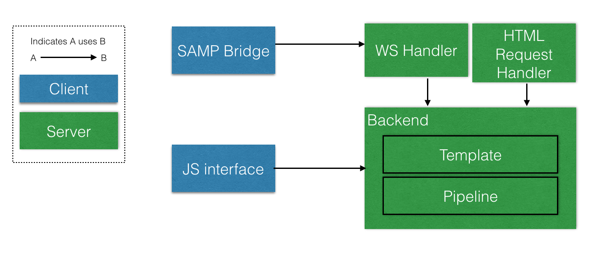

Design
======

This is the main design document, which is primarily aimed at developers

Overview
--------

The web interface initiates a WebSocket connection when started in order to drive the main UI. A secondary connection over the SAMP bridge allows communication between the web interface and SAMP enabled applications (such as TOPCAT, Aladdin etc.) running locally on the client machine.

Data Model
----------

Worktables always contain the following:

* A Common Workflow Language (CWL) file detailing the workflow
* A Yaml file providing a row template
* The table data

In addition, each Worktable may store any number of files, typically the program that is to be invoked by the workflow
